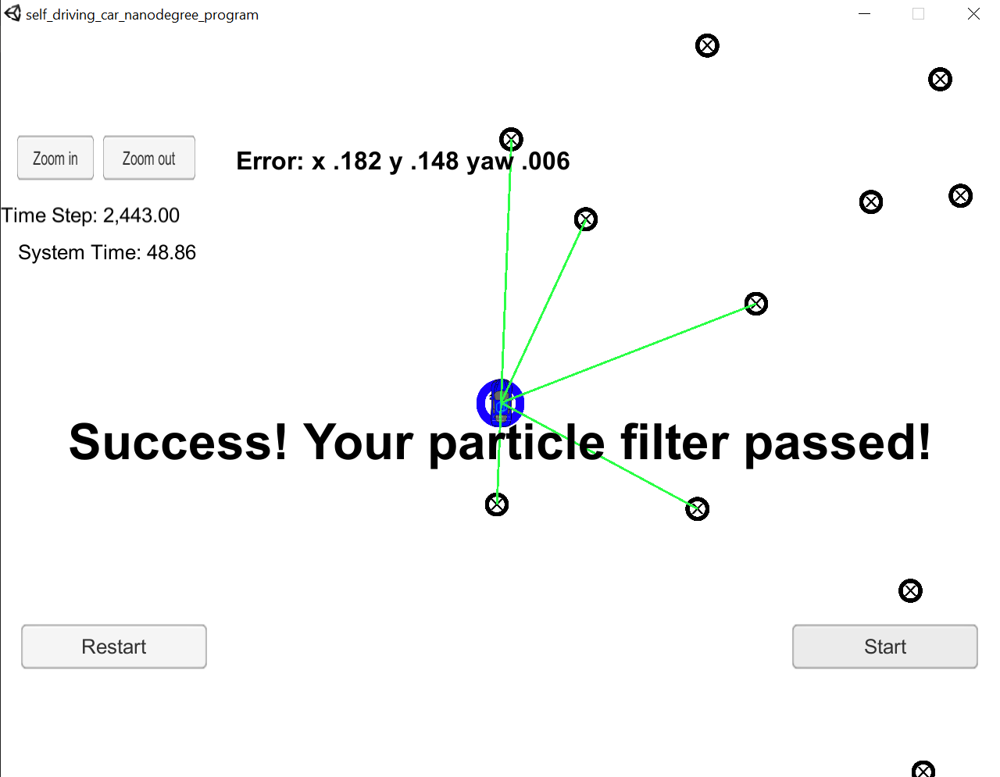

# Particle-Filter

This project implements a particle filter in C++. It uses simulated sensor measurements that detects predefined landmarks in a map to improve vehicle's localization accuracy.

The project is composed by the following:

main.cpp: Interfaces the project with Udacity Term 2 simulator.
particle_filter.cpp: Defines a particle filter class that is composed by 4 main functions.
* `ParticleFilter::init()` that initializes a certain number of particles `num_particles` given an initial estimate of the vehicle's location. This initial estimate could be, for instance, a GPS measurement.
* `ParticleFilter::prediction()` that predicts what next location estimate will be given current noisy belief of vehicle's location and noiseless current control input.
* `ParticleFilter::updateWeights()` that transforms landmark observations from vehicle to map coordinate system and each observation is assigned to a map landmark. Following, weights are updated using a multi-variate gaussian which takes as parameters: true landmark locations (x,y), landmark observations in map coordinates (mu_x,mu_y)) and landmark measurement uncertainty (std_x,std_y).
* `ParticleFilter::resample()` that keeps particles that have better estimates while discarding worse particles.
map.h: Defines a map class that contains a vector with all landmarks along with their ID's and locations.
map_data.txt: File that contains all landmark information.
helper_functions.h: Contains functions used to interface with simulator

The figure below illustrates the performance of the particle filter implemented. [Here is a link for a sample video output!](https://www.youtube.com/watch?v=prqvmrtNon4)
Landmarks are represented by black circles with a cross inside, measurements are shown as green lines, the blue car represents the real location of the vehicle and the blue circle is the estimated location of the vehicle. Note that the estimation error is under 20cm for each dimension and 0.006 for the heading direction.